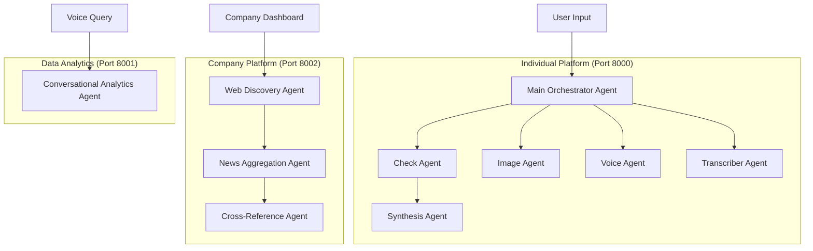

# 🌟 Genesis: Multi-Agent Truth Verification System

<div align="center">


*Revolutionary AI-powered misinformation detection with autonomous agent orchestration*

[](https://github.com/yourusername/genesis)
[](https://github.com/yourusername/genesis)
[](https://github.com/yourusername/genesis)
[](https://github.com/yourusername/genesis)

</div>

## 🎯 Built for AWS IMPACTX 2025 - Misinformation Track

**Genesis** is the world's most advanced Multi-Agent Truth Verification System that deploys **10 autonomous AI agents** across **dual platforms** to combat misinformation at scale. Unlike reactive fact-checkers, Genesis operates proactively through swarm intelligence, processing text, voice, images, and data streams simultaneously.

> *"In a world drowning in information, Genesis is the lighthouse that cuts through the fog of misinformation."*

---

## 🏗️ Dual Platform Architecture

Genesis operates on **two specialized platforms** serving different user needs:

### 🔍 **Individual Verification Platform** 
*For journalists, traders, researchers, and content creators*

### 🏢 **Corporate Intelligence Platform**
*For companies monitoring reputation and crisis detection*

---

## 🚀 Complete Agent Ecosystem (10 Agents)



### 🤖 Individual Platform Agents

| Agent | Purpose | Technology | Capabilities |
|-------|---------|------------|-------------|
| **🎯 Main Orchestrator** | Intelligent routing & coordination | Groq Llama 3.3 70B | A2A communication, task distribution |
| **🔍 Check Agent** | Multi-source verification | Google Gemini + Search | 5+ source cross-reference, confidence scoring |
| **🖼️ Image Agent** | Visual content analysis | Google Gemini Vision | OCR, image fact-checking, deepfake detection |
| **🎤 Voice Agent** | Real-time voice processing | Google Gemini Audio | Live conversations, voice verification |
| **📝 Transcriber Agent** | Audio-to-text conversion | Google Gemini Audio | WebRTC integration, real-time transcription |
| **⚡ Synthesis Agent** | Professional responses | Groq Llama 3.3 70B | Structured reports, bias assessment |

### 🏢 Corporate Intelligence Agents

| Agent | Purpose | Technology | Capabilities |
|-------|---------|------------|-------------|
| **🌐 Web Discovery** | Company web presence mapping | Google Gemini + Search | Official websites, social media, investor relations |
| **📰 News Aggregation** | Comprehensive news gathering | Google Gemini + Search | Multi-category news, temporal filtering |
| **✅ Cross-Reference** | News verification & analysis | Google Gemini + Search | Fact-checking, sentiment analysis, crisis detection |

### 💬 Data Analytics Agent

| Agent | Purpose | Technology | Capabilities |
|-------|---------|------------|-------------|
| **🧠 Conversational Analytics** | Natural language data queries | Google Gemini | Chat with verified data, trend analysis |

---

## ✨ Individual Platform Features

### 🔥 Real-Time Verification
- **Sub-second response time** for text claims
- **Live voice conversations** with AI agents
- **Instant image verification** via OCR + fact-checking
- **WebSocket streaming** for real-time updates
- **Multi-modal processing** (text, voice, images)

### 🌐 Chrome Extension Integration
- **Right-click verification** of highlighted text
- **Auto-scan articles** for misinformation
- **Real-time alerts** for trending false claims
- **Seamless workflow** integration

### 🎯 Advanced Verification Features
- **Confidence scoring** (0.0-1.0 precision)
- **Bias assessment** (Low/Medium/High)
- **Impact scoring** for claim severity
- **Source credibility analysis**
- **Temporal trend tracking**

---

## 🏢 Corporate Intelligence Dashboard

### 📊 **Comprehensive Company Monitoring**

The Corporate Intelligence Platform provides **automated news monitoring and crisis detection** for companies with advanced analytics and competitor analysis.

#### 🎯 **Core Dashboard Features**

##### **1. Multi-Period Analysis**
- **Today**: Last 24 hours analysis
- **This Week**: 7-day comprehensive review  
- **This Month**: 30-day trend analysis
- **This Year**: 365-day historical overview

##### **2. Real-Time Sentiment Analysis**
- **Visual Sentiment Gauge** (0-100 scale with animated needle)
- **Color-coded indicators**: Green (70-100), Yellow (40-69), Red (0-39)
- **Sentiment breakdown**: Positive/Neutral/Negative counts
- **Trend tracking** with percentage changes

##### **3. Crisis Alert System**
- **3-Level Risk Assessment**: LOW/MEDIUM/HIGH
- **Risk scoring** (0-100 scale)
- **Negative spike detection** with automatic alerts
- **Crisis impact analysis** by affected topics
- **Real-time mention tracking**

##### **4. Competitor Intelligence**
- **Side-by-side comparison** with up to 3 competitors
- **Comparative metrics**: Sentiment scores, mention counts, crisis levels
- **Market positioning analysis**
- **Competitive sentiment tracking**

#### 📈 **Advanced Analytics & Visualizations**

##### **Interactive Charts & Graphs**
- **Sentiment Gauge**: Animated semi-circular display
- **Pie Charts**: Sentiment distribution, news authenticity breakdown
- **Line Charts**: 7-day sentiment trends with multi-line tracking
- **Bar Charts**: Negative news spike tracking, source analysis
- **Temporal Graphs**: Historical trend analysis

##### **Data Breakdown Sections**
- **Sentiment by Topic**: Category-wise sentiment analysis
- **Sentiment by Source**: Media outlet credibility tracking
- **Geographic Analysis**: Regional sentiment variations
- **Timeline Analysis**: Chronological event tracking

#### 🚨 **Crisis Management Features**

##### **Fake News Detection**
- **Automated fake news identification** with reasoning
- **Confidence scoring** for each detection
- **Source verification** and credibility assessment
- **Impact analysis** for potential reputation damage

##### **Negative Spike Alerts**
- **Real-time monitoring** for sudden negative mention increases
- **Percentage change tracking** (from X to Y mentions)
- **Automatic alert generation** when thresholds exceeded
- **Historical spike pattern analysis**

##### **Live News Feed**
- **Real-time news aggregation** with verification status
- **Sentiment-coded articles** (color-coded by sentiment)
- **Source credibility indicators**
- **Verification badges** (REAL/FAKE/UNCERTAIN)

#### 📋 **Report Management System**

##### **Smart Report Detection**
- **Today's analysis check**: Automatic detection of current analysis
- **Historical report access**: Last 10 analyses with filtering
- **Report comparison**: Side-by-side analysis of different periods
- **Export capabilities**: PDF/CSV report generation

##### **Past Reports History**
- **Chronological listing** with date/time stamps
- **Analysis period indicators** (Today/Week/Month/Year badges)
- **Crisis level summaries** for quick overview
- **One-click report loading** with "Back to Today" option

---

## 🏗️ Technology Stack

<div align="center">

### Frontend


### Backend Services


### Real-time & Integration


</div>

### 🔧 **Multi-Service Architecture**

```
📦 Genesis Backend Services
├── 🎯 Port 8000: Individual Platform (main.py)
│   ├── Main Orchestrator Agent
│   ├── Check Agent (Google Gemini + Search)
│   ├── Image Agent (Google Gemini Vision)
│   ├── Voice Agent (Google Gemini Audio)
│   ├── Transcriber Agent
│   └── Synthesis Agent (Groq Llama 3.3)
│
├── 🏢 Port 8002: Company Intelligence (company.py)
│   ├── Web Discovery Agent
│   ├── News Aggregation Agent
│   └── Cross-Reference Agent
│
└── 💬 Port 8001: Data Analytics (data.py)
    └── Conversational Analytics Agent
```

---

## 📈 Business Model & Pricing

### 👤 **Individual User Subscriptions**
*Targeted at journalists, traders, researchers, and content creators*

| Tier | Price | Features | Target Users |
|------|-------|----------|-------------|
| **Free** | ₹0/month | 10 queries/day, basic text chat, limited transcription | Students, casual users |
| **Pro** | ₹500/month | 150 queries/day, all features, priority support | Professional journalists, researchers |
| **Pro Max** | ₹3,000/month | Unlimited access, API integration, white-label | Content creators, small media companies |

### 🏢 **Corporate Intelligence Platform**
*Custom enterprise solutions for comprehensive misinformation monitoring*

#### **Enterprise Features**
- **Automated Company Monitoring**: 24/7 news tracking and analysis
- **Crisis Alert System**: Real-time notifications for reputation threats
- **Competitor Intelligence**: Multi-company comparative analysis
- **Custom Dashboards**: Branded analytics interfaces
- **API Integration**: Seamless workflow integration
- **Multi-user Access**: Role-based team permissions
- **Historical Analytics**: Temporal trend analysis and reporting
- **White-label Solutions**: Fully customizable for enterprise branding

#### **Pricing Structure**
- **Starter**: ₹25,000/month (1 company, basic monitoring)
- **Professional**: ₹75,000/month (3 companies, advanced analytics)
- **Enterprise**: ₹2,00,000/month (Unlimited companies, full features)
- **Custom Solutions**: Quote-based for specialized requirements

### 💰 **Revenue Projections**
- **Year 1**: ₹10 crore (10K free users, 500 Pro, 20 enterprise clients)
- **Year 2**: ₹66 crore (50K users, 2K Pro, 100 enterprise clients)
- **Year 3**: ₹200+ crore (200K+ users, market leadership position)

---

## 🎮 Quick Start Guide

### 1. **Clone & Install**
```bash
git clone https://github.com/yourusername/genesis.git
cd genesis
npm install
```

### 2. **Environment Setup**
```bash
# Create .env.local
GOOGLE_API_KEY=your_gemini_api_key
GROQ_API_KEY=your_groq_api_key
MONGODB_URI=your_mongodb_connection
NODE_ENV=development
```

### 3. **Start Backend Services**
```bash
# Terminal 1: Individual Platform (port 8000)
cd app/backend
pip install -r requirements.txt
python main.py

# Terminal 2: Company Intelligence (port 8002)
python company.py

# Terminal 3: Data Analytics (port 8001)
python data.py
```

### 4. **Launch Frontend**
```bash
npm run dev
# Visit http://localhost:3000
```

### 5. **Install Chrome Extension**
1. Open Chrome → Extensions → Developer mode
2. Load unpacked → Select `chrome-extension` folder
3. Pin the Veritas extension

---

## 🎯 Usage Examples

### **Individual Platform**

#### Text Verification
```javascript
// Simple claim verification
const result = await verifyText("COVID vaccines contain microchips");
// Returns: confidence: 0.95, verdict: "FALSE", sources: [...]
```

#### Voice Interaction
```javascript
// Real-time voice verification
startVoiceChat();
// Speak: "Is it true that the moon landing was fake?"
// AI responds with verification and sources
```

#### Image Analysis
```javascript
// Upload screenshot or image
const imageResult = await verifyImage(imageFile);
// Extracts text claims and verifies each one
```

### **Company Intelligence Platform**

#### Dashboard Analytics
```javascript
// Get comprehensive company analysis
const dashboard = await getCompanyDashboard("Tesla");
// Returns: sentiment scores, crisis alerts, competitor analysis
```

#### Crisis Monitoring
```javascript
// Real-time crisis detection
const crisisAlert = await monitorCompany("Apple", "today");
// Returns: risk_level: "HIGH", risk_score: 85, affected_topics: [...]
```

#### Competitor Analysis
```javascript
// Multi-company comparison
const comparison = await compareCompanies("Tesla", ["Ford", "GM", "BMW"]);
// Returns: side-by-side sentiment, mentions, crisis levels
```

---

## 🏆 Why Genesis is Superior

| Feature | Traditional Fact-Checkers | Genesis Individual | Genesis Corporate |
|---------|---------------------------|-------------------|-------------------|
| **Response Time** | Hours to days | Sub-second | Real-time monitoring |
| **Sources** | 1-2 manual checks | 5+ automated cross-reference | Comprehensive news aggregation |
| **Modalities** | Text only | Text + Voice + Images + Data | Multi-modal + Historical analysis |
| **Scalability** | Manual processes | Autonomous agent swarm | Enterprise-grade automation |
| **Crisis Detection** | Reactive | Proactive scanning | Predictive crisis alerts |
| **Confidence Scoring** | Binary true/false | 0.0-1.0 precision scoring | Risk assessment + impact analysis |
| **Analytics** | Basic reporting | Individual insights | Corporate intelligence dashboards |
| **Integration** | Limited | Chrome extension + API | Full enterprise integration |

---

## 🌍 Impact & Vision

### **Problems Solved**

#### **Individual Users**
- **Information Overload**: Cut through noise with AI-powered verification
- **Professional Workflows**: Enable journalists, traders, researchers to work faster
- **Real-time Verification**: Instant fact-checking during breaking news
- **Multi-modal Analysis**: Verify text, voice, images, and data simultaneously

#### **Corporate Users**
- **Reputation Management**: Protect companies from misinformation damage
- **Crisis Prevention**: Early detection of reputation threats
- **Competitive Intelligence**: Monitor competitor sentiment and market position
- **Automated Monitoring**: 24/7 surveillance without human intervention

### **Target Ecosystem**

#### **Individual Platform Users**
- 📰 **Journalists** - Real-time fact-checking during breaking news
- 📈 **Traders** - Verify market-moving information instantly  
- 🎥 **Content Creators** - Ensure accuracy before publishing
- 🔬 **Researchers** - Academic and professional fact verification

#### **Corporate Platform Users**
- 🏢 **Large Corporations** - Reputation monitoring and crisis management
- 📺 **Media Companies** - Newsroom verification workflows
- 💼 **PR Agencies** - Client reputation management
- 🏛️ **Government Agencies** - Public information verification

---

## 🔒 Security & Privacy

### **Data Protection**
- **End-to-end encryption** for all communications
- **GDPR compliant** data handling
- **No personal data storage** beyond necessary authentication
- **Secure API endpoints** with rate limiting

### **Authentication System**
- **Dual authentication flows**: Individual users and companies
- **bcryptjs password hashing** with 12 salt rounds
- **HTTP-only cookies** preventing XSS attacks
- **Session management** with automatic cleanup

---

## 🤝 Contributing

We welcome contributions! Please see our [Contributing Guide](CONTRIBUTING.md) for details.

### **Development Setup**
1. Fork the repository
2. Create feature branch: `git checkout -b feature/amazing-feature`
3. Commit changes: `git commit -m 'Add amazing feature'`
4. Push to branch: `git push origin feature/amazing-feature`
5. Open Pull Request

### **Agent Development**
- Follow the **Agent-to-Agent (A2A) communication** protocols
- Implement **confidence scoring** for all verification results
- Ensure **real-time processing** capabilities
- Add comprehensive **error handling** and **fallback mechanisms**

---

## 📄 License

This project is licensed under the MIT License - see the [LICENSE](LICENSE) file for details.

---

## 🙏 Acknowledgments

- **AWS IMPACTX 2025** for the misinformation challenge inspiration
- **Google Gemini** for powering our AI agents with search capabilities
- **Groq** for high-performance text processing with Llama 3.3 70B
- **MongoDB** for temporal graph storage and analytics
- **FastAPI** for high-performance multi-service backend
- **Next.js** for the modern, responsive frontend experience

---

<div align="center">

**Built with ❤️ for a world free from misinformation**

### 🚀 **Ready to Combat Misinformation?**

[🌐 Live Demo](https://genesis-truth.vercel.app) • [📖 Documentation](https://docs.genesis-truth.com) • [💬 Discord](https://discord.gg/genesis) • [🐦 Twitter](https://twitter.com/genesis_truth)

**Genesis: Where Truth Meets Technology**

</div>
