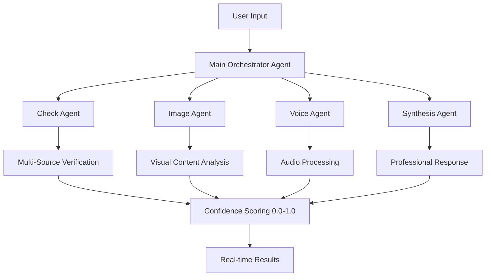

# 🌟 Genesis: Multi-Agent Truth Verification System

<div align="center">
  


*Revolutionary AI-powered misinformation detection with autonomous agent orchestration*

[](https://github.com/yourusername/genesis)
[](https://github.com/yourusername/genesis)
[](https://github.com/yourusername/genesis)
[](https://github.com/yourusername/genesis)

</div>

## 🎯 Built for MumbaiHacks 2025 - Misinformation Track

**Genesis** is the world's most advanced Multi-Agent Truth Verification System that deploys 7 autonomous AI agents to combat misinformation at scale. Unlike reactive fact-checkers, Genesis operates proactively through swarm intelligence, processing text, voice, images, and data streams simultaneously.

> *"In a world drowning in information, Genesis is the lighthouse that cuts through the fog of misinformation."*

---

## 🚀 Core Architecture



### 🤖 Agent Ecosystem

| Agent | Purpose | Capabilities |
|-------|---------|-------------|
| **🎯 Main Orchestrator** | Intelligent routing & coordination | A2A communication, task distribution |
| **🔍 Check Agent** | Multi-source verification | 5+ source cross-reference, confidence scoring |
| **🖼️ Image Agent** | Visual content analysis | OCR, image fact-checking, deepfake detection |
| **🎤 Voice Agent** | Audio processing | Real-time transcription, voice verification |
| **📝 Synthesis Agent** | Professional responses | Structured reports, bias assessment |
| **🌐 Web Discovery** | Corporate intelligence | News aggregation, trend analysis |
| **� Conv-ersational AI** | Natural language queries | Chat with verified data |

---

## ✨ Key Features

### � Real-Timei Verification
- **Sub-second response time** for text claims
- **Live voice conversations** with AI agents
- **Instant image verification** via OCR + fact-checking
- **WebSocket streaming** for real-time updates

### 📊 Corporate Intelligence Dashboard
- **Automated news monitoring** for companies
- **Sentiment analysis** with visual gauges (0-100 scale)
- **Crisis alert system** (LOW/MEDIUM/HIGH risk levels)
- **Competitor analysis** (up to 3 competitors side-by-side)
- **Historical trend tracking** with temporal graphs

### 🌐 Chrome Extension Integration
- **Right-click verification** of highlighted text
- **Auto-scan articles** for misinformation
- **Real-time alerts** for trending false claims
- **Seamless workflow** integration

### 🎯 Multi-Modal Processing
- **Text**: Natural language claim verification
- **Voice**: Real-time audio transcription & verification
- **Images**: Visual content analysis with confidence scoring
- **Data**: Conversational analytics with natural language queries

---

## 🏗️ Technology Stack

<div align="center">

### Frontend


### Backend


</div>

---

## 📈 Business Model

### 👤 Individual Subscriptions

| Tier | Price | Features |
|------|-------|----------|
| **Free** | ₹0/month | 10 queries/day, basic text chat |
| **Pro** | ₹500/month | 150 queries/day, all features unlocked |
| **Pro Max** | ₹3,000/month | Unlimited access, API integration |

### 🏢 Enterprise Solutions

- **Custom Company Dashboards** with automated monitoring
- **White-label solutions** for media organizations  
- **API access** for workflow integration
- **Dedicated support** with custom training

**Revenue Projection**: ₹200+ crore by Year 3

---

## 🎮 Quick Start

### 1. Clone & Install
```bash
git clone https://github.com/yourusername/genesis.git
cd genesis
npm install
```

### 2. Environment Setup
```bash
# Create .env.local
GOOGLE_API_KEY=your_gemini_api_key
MONGODB_URI=your_mongodb_connection
NODE_ENV=development
```

### 3. Start Backend Services
```bash
# Terminal 1: Main agents (port 8000)
cd app/backend
pip install -r requirements.txt
python main.py

# Terminal 2: Company intelligence (port 8002)
python company.py

# Terminal 3: Data query API (port 8001)
python data.py
```

### 4. Launch Frontend
```bash
npm run dev
# Visit http://localhost:3000
```

### 5. Install Chrome Extension
1. Open Chrome → Extensions → Developer mode
2. Load unpacked → Select `chrome-extension` folder
3. Pin the Veritas extension

---

## 🎯 Usage Examples

### Text Verification
```javascript
// Simple claim verification
const result = await verifyText("COVID vaccines contain microchips");
// Returns: confidence: 0.95, verdict: "FALSE", sources: [...]
```

### Voice Interaction
```javascript
// Real-time voice verification
startVoiceChat();
// Speak: "Is it true that the moon landing was fake?"
// AI responds with verification and sources
```

### Image Analysis
```javascript
// Upload screenshot or image
const imageResult = await verifyImage(imageFile);
// Extracts text claims and verifies each one
```

### Company Monitoring
```javascript
// Automated company intelligence
const dashboard = await getCompanyDashboard("Tesla");
// Returns sentiment, crisis alerts, competitor analysis
```

---

## 🏆 Why Genesis is Superior

| Feature | Traditional Fact-Checkers | Genesis |
|---------|---------------------------|---------|
| **Response Time** | Hours to days | Sub-second |
| **Sources** | 1-2 manual checks | 5+ automated cross-reference |
| **Modalities** | Text only | Text + Voice + Images + Data |
| **Scalability** | Manual processes | Autonomous agent swarm |
| **Crisis Detection** | Reactive | Proactive monitoring |
| **Confidence Scoring** | Binary true/false | 0.0-1.0 precision scoring |

---

## 🌍 Impact & Vision

### Problem Solved
- **Misinformation Crisis**: Combat false information during global crises
- **Information Overload**: Cut through noise with AI-powered verification
- **Professional Workflows**: Enable journalists, traders, researchers to work faster
- **Corporate Reputation**: Protect companies from misinformation damage

### Target Users
- 📰 **Journalists** - Real-time fact-checking during breaking news
- 📈 **Traders** - Verify market-moving information instantly  
- 🎥 **Content Creators** - Ensure accuracy before publishing
- 🏢 **Companies** - Monitor reputation and detect crises early

---

## 🤝 Contributing

We welcome contributions! Please see our [Contributing Guide](CONTRIBUTING.md) for details.

### Development Setup
1. Fork the repository
2. Create feature branch: `git checkout -b feature/amazing-feature`
3. Commit changes: `git commit -m 'Add amazing feature'`
4. Push to branch: `git push origin feature/amazing-feature`
5. Open Pull Request

---

## 📄 License

This project is licensed under the MIT License - see the [LICENSE](LICENSE) file for details.

---

## 🙏 Acknowledgments

- **MumbaiHacks 2025** for the misinformation challenge
- **Google Gemini** for powering our AI agents
- **MongoDB** for temporal graph storage
- **FastAPI** for high-performance backend
- **Next.js** for the modern frontend

---

<div align="center">

**Built with ❤️ for a world free from misinformation**

[🌐 Live Demo](https://genesis-truth.vercel.app) • [📖 Documentation](https://docs.genesis-truth.com) • [💬 Discord](https://discord.gg/genesis) • [🐦 Twitter](https://twitter.com/genesis_truth)

</div>